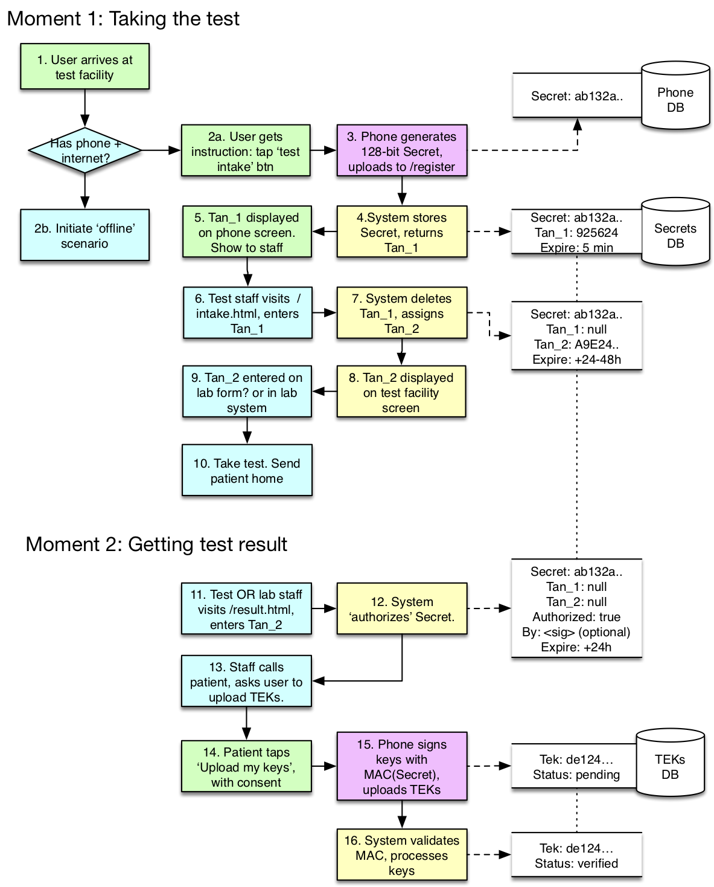

# Covid-19 Exposure Notification Cryptografie raamwerk

> Disclaimer: This is a translation/alternative version of the original document (link where possible): original_document_name.ext, version x.x.
> The original document is the authoritative version of this document and might include changes that are not reflected in this alternative version.
> For the most up to date / accurate information, please refer to the original document.

## Colofon

**Auteur:** Dienst ICT Uitvoering Ministerie van Economische Zaken

**Version:** 0.34

**Datum:** 29 Mei 2020

**Status:** Wordt geschreven

## Samenvatting

Volgt later

## Inhoud

  * [1. Inleiding](#1-inleiding)
  * [1.1 Achtergrond](#11-achtergrond)
  * [1.2 Doelstelling en uitgangspunten](#12-doelstelling-en-uitgangspunten)
  * [1.3 Overzicht](#13-overzicht)
  * [1.4 Definities](#14-definities)
  * [2. TEK life cycle managment](#2-tek-life-cycle-managment)
  * [2.1 Key generation and derivation](#21-key-generation-and-derivation)
  * [2.2. Key Storage](#22-key-storage)
  * [2.3 Key Usage](#23-key-usage)
    + [2.3.1 Encryptie, generatie van RPI en AEM](#231-encryptie--generatie-van-rpi-en-aem)
    + [2.3.2 Encryptie, generatie van potentially contacted RPIs](#232-encryptie--generatie-van-potentially-contacted-rpis)
  * [2.4 Key Backup](#24-key-backup)
  * [2.5 Key Archival](#25-key-archival)
  * [2.6 Key Destruction](#26-key-destruction)
  * [2.7 Key Distributie](#27-key-distributie)
    + [2.7.1 Upload van TEKs](#271-upload-van-teks)
    + [2.7.2 Download van TEKs](#272-download-van-teks)
   * [2.8 Crypto Specs, algorithms, schema's and protocols](#28-crypto-specs--algorithms--schema-s-and-protocols)
  * [2.9 Rest risico's](#29-rest-risico-s)

**Documentbeheer**

**Versiehistorie**

| Versie | Datum | Status | Auteur |
|--------|-------|--------|--------|
|        |       |        |        |
|        |       |        |        |
|        |       |        |        |

**Versie goedkeuring**

| Versie | Datum | Naam | Functie/afdeling |
|--------|-------|------|------------------|
|        |       |      |                  |
|        |       |      |                  |
|        |       |      |                  |

**Wijzigingen**

| Versie | Wijzigingen |
|--------|-------------|
|        |             |
|        |             |
|        |             |

**referenties**

| Document                                                                                                             	| Auteur      	|
|----------------------------------------------------------------------------------------------------------------------	|-------------	|
| Exposure Notification Cryptography Specification April 2020 v1.2                                                     	| GACT        	|
| SECURITY ANALYSIS OF THE COVID-19 CONTACT TRACING SPECIFICATIONS BY APPLE INC. AND GOOGLE INC                        	| Yaron Gvili 	|
| Decentralized Privacy-Preserving Proximity TracingOverview of Data Protection and Security. Version: 3rd April 2020. 	|             	||                                                                                             

## 1. Inleiding

###### Dit document is in bewerking en ter review.
###### Er zijn in deze versie ook nog de rode tekstdelen (H6) die nog te verwerken metadata bevatten.

## 1.1 Achtergrond

Binnen het Covid aanvalsprogramma zijn er een aantal werkstromen die allemaal bijdragen aan het hoofddoel, Nederland sneller en beter door deze crisis krijgen. Relevant in deze context zijn de technische werkstromen:

1. De GGD Covid19 notificatieapp - een breed uitgezette mobile app voor het publiek dat versneld informatie verstrekt aan de contacten van een door een laboratorium test besmet gevonden persoon.

1. Een Thuis Rapportage App - een ondersteunden app voor positief geteste personen die actief begeleid worden door de GGD.

1. Een directe ondersteuning van de bestaande B&C opsporingsonderzoeken middels een portaal of website die een deel van de huidige formulier/telefoon gebaseerde processen automatiseert.

1. Een eventuele kleinschalige epidemiologische app die zeer complete en accurate input levert voor de RIVM modellen op basis van een kleine groep (vergelijkbaar met de Nivel peilstations en Pienter onderzoeken)

Dit document beperkt zich tot optie 1 - "GGD Covid19 notificatieapp".

## 1.2 Doelstelling en uitgangspunten

Doelstelling van dit document is om uitgaande van het Google Apple Exposure Notification (GAEN) raamwerk te komen tot een daarop aansluitend cryptosysteem voor de Covid19 notificatieapp ondersteuning van de bescherming van de privacy van deelnemende personen en de integriteit van de verwerking. Het GAEN raamwerk beoogt anonimiteit van deelnemers te waarborgen op basis van een cryptografische oplossing waarbij een zogenaamde Temporary Exposure Key (TEK) centraal staat. Iedere deelnemer krijgt t.b.v. de anonimiteit een willekeurige ("random") cryptografische sleutel toegewezen. Het raamwerk moet zorgdragen voor behoud van de anonimiteit en de integriteit van die sleutel. Het model dat daarbij gehanteerd wordt is de algemeen gebruikelijke fasering binnen [het lifecycle management van cryptografische sleutels]{.underline}. Voor cryptografische standaarden worden de standaarden gebruikt van:

1.  COMMISSION RECOMMENDATION (EU) 2020/518 of 8 April 2020

1.  GACT Exposure Notification Cryptography Specification

1.  NCSC (NL)

1.  ENISA-Sogis (EU)

1.  Relevante nationale, internationale en industry de-facto standaarden(met name die waarop het GACT document terugvalt).

De keuze voor de cryptografische oplossingen is tot stand gekomen tegen de achtergrond van andere, niet cryptografische beveiligingsmaatregelen en het belang van gebruikersvriendelijkheid van de app. Het cryptoraamwerk is onderdeel van een breder pakket aan maatregelen en dekt niet alle risico's af. Bekende (rest-) risico's worden apart benoemd. Deze afwegingen (inclusief de noodzaak van compenserende maatregelen en eisen aan de governance) komen samen in het Data Protection Impact Assessment (DPIA) document.

In de eerste versie van dit document wordt een vereenvoudigd model gehanteerd van verwerkingslocaties bestaande uit mobiele telefoons (MT), upload server (US) en download server (DS). Naamgeving is verder op basis van GAEN en Dp-3T.

## 1.3 Overzicht

###### Bijgewerkt plaatje nog toevoegen; grijpt in op discussie eerst upload of eerst positief test resultaat en dan upload.

## 1.4 Definities

**begrip**|**synoniem**|**omschrijving**
-----|-----|-----
anoniem| |Niet herleidbaar tot identiteit van persoon en / of telefoon of daaraan bijdragend in samenhang met andere data
integriteit| |Hier beperkt tot controleerbaarheid op niet gewijzigd zijn van echte TEKs
identiteit| |Set van eigenschappen met bepaalde waarde die gebruikt kan worden om een element uit een verzameling (persoon of machine) uniek re selecteren.
Authenticatie | |Technisch bewijzen van een identiteit van mens of machine
Authenticiteit|Echtheid|Combinatie van integriteit en authenticatie
MT| |Mobiele Telefoon
TEK|Temporary Exposure Key|Dagelijkse random warde van 128 bit als basis voor afleiding van dagelijkse RPI-Key en AEM-Key
TEKRollingPeriod|Roll over time|Max Life Time of TEK
RPI-Key| |Dagelijkse 128 bit sleutel als basis voor encryptie van een string van vaste en op basis van interval variabele data tot de RPI
ENIntervalNumber|10 minutes Number|Number of 10 minute periodes elapsed since
RPI|Rolling Proximity Idenfier|Anonieme “identifier” welke gebroadcast wordt door bluetooth op de MT
AEM-Key| |Dagelijkse 128 bit sleutel als basis voor encryptie van een string van variabele data tot de AEM
AEM|Associated Encrypted Metadata|Versleutelde metadata welke in combinatie met RPI gebroadcast wordt
DK|Diagnosed Key
Infected Key|
DS|Diagnose(d) Server
Publisher Server
Download Server
Distribution Server|Centrale server waarvandaan diagnose keys gedownload worden
CDN|Content Delivery Network|voor verdere propagatie en distributie
RS|Receiving Server
UpLoad Server|Centrale server waarnaartoe diagnose keys ge-upload worden.
DRS|Distributed RS|Meerdere “locale” front end receivers.

## 2. TEK life cycle managment

Het Cryptoraamwerk wordt opgebouwd rond de lifecycle van de Temporary Exposure Keys (TEKs). De TEK keys van een positief geteste deelnemer worden ook wel Diagnose(d) Keys genoemd.

### 2.1 Key generation and derivation

Het GAEN raamwerk beoogt de privacy van deelnemers te borgen door dagelijks een ieder een anonieme identifier toe te kennen op basis van een random sleutel, de **TEK** waarvan 2 voor encryptie te gebruiken sleutels afgeleid worden, de **RPIK** en **AEMK**, zie tabel.

| generation |      |                                   |      |                                              |        |   |
|------------|------|-----------------------------------|------|----------------------------------------------|--------|---|
| Freq       | Name |                                   | size | source                                       | schema |   |
| daily      | TEK  | Temporary Exposure Key            | 128  |                                              | CRNG   |   |
| **derivation** |      |                                   |      |                                              |        |   |
|            |      |                                   |      | schema                                       |        |   |
| daily      | RPIK | Rolling Proximity Identifier Key  | 128  | HKDF(TEKi, NUL L, UTF8("EN-RPIK"),16)        |        |   |
| daily      | AEMK | Associated Encrypted Metadata Key | 128  | AEMK ← HKDF(TEKi , NULL, UTF8("EN-AEMK"),16) |        |   |

Afleiding van de 2 encryptie sleutels is deterministisch en zonder toevoeging van een random waarde. Deze oplossing levert alleen werkelijk anonimiteit als er sprake is van een Truly Random Number voor de TEK. Daarbij spelen 2 eigenschappen, statistisch random èn non predictability.

Apple geeft aan te werken op basis van

1.  A True random number generator als bron.
The /dev/random generator is **a true random number generator** that obtains entropy from interrupts generated by the devices and sensors attached to the system and maintains an entropy pool. **The NDRNG provides 128-bits of entropy.**

2.  The **NDRNG** feeds entropy from the pool into the DRBG on demand. A FIPS 140-2 approved deterministic random bit generator based on a block cipher as specified in NIST SP 800-90A is used.
Deze tweede functie heeft de non predictability eigenschap niet meer maar door de 128 bits input (=output) blijft de 128 bits entropie gehandhaafd.

Zie verder bijlage mail

###### Google nog geen antwoord, opgenomen in risk register.

## 2.2. Key Storage

De TEKs en afgeleide RPIK en AEMK keys zijn eigendom van de gebruiker en liften mee op out of the box aanwezige beveiligingsmaatregelen op de mobiele telefoons.

###### De TEKs en hun afgeleiden zijn in combinatie met de telefoon en dus de identiteit van de gebruiker een medisch gegeven ? TEKs en alle afgeleiden moeten der halve AES versleuteld worden met applicatie specifieke sleutel ?

Apple heeft hun platform security en device en data management
beschreven in:

- <https://www.apple.com/business/docs/site/AAW_Platform_Security.pdf>

-   <https://www.apple.com/business/docs/resources/Managing_Devices_and_Corporate_Data_on_iOS.pdf>

###### Google:

###### Vraag staat uit bij Google ?

## 2.3 Key Usage

### 2.3.1 Encryptie, generatie van RPI en AEM

De RPIK en AEMK (beiden afgeleid van de TEK) worden iedere interval (10-20 minuten) gebruikt voor encryptie waarbij een voor het interval unieke Rolling Poximity Identifier (RPI) en versleutelde metadata, Associated Encrypted Metadata (AEM) ontstaan. Beide worden gezamenlijk met bluetooth gebroadcast. Er is vanuit GAEN afstemming op de eveneens gebroadcaste temporary mac adressen ter voorkoming van linking van de diverse PRIs. Dit gebeurt overigens niet 'in' de app; maar in een proprietary library die onderdeel uitmaakt van het operating system van de mobile telefoon leverancier. Deze informatie is dus niet beschikbaar voor de App (voor het besmet&consent moment).

###### De huidige versie van het GAEN raamwerk kent nog wel de incorporatie van datum tijd in de RPI waardoor uiteindelijk toch een verband en volgorde te maken is. Wijzigingsvoorstel staat uit bij Apple en Google. (Nota bene: bij een matchende Tek is de telefoon wel instaat om de koppeling naar tijd te maken; want er is bekend wanneer de RPI ontvangen is; en de API maakt deze informatie beschikbaar (met een granulariteit van 30 minuten)

| Usage:    |      |                               |            |                                 |
|-----------|------|-------------------------------|------------|---------------------------------|
| **encryptie** |      |                               |            |                                 |
| freq      | naam |                               | size       | Schema/algoritme                |
| 10 m      | RPI  | Rolling Proximity Identifier  | 128 -> 128 | AES128(RPIK , PaddedData)       |
| 10 m      | AEM  | Associated Encrypted Metadata | 32 -> 128  | AES128−CTR(AEMK, RPI, Metadata) |

### 2.3.2 Encryptie, generatie van potentially contacted RPIs

Na ontvangst van de diagnose keys wordt het voor de eigen RPI gebruikte proces van key derivation en 10-min-interval encryption hiermee herhaald ten einde een match te kunnen maken met opgeslagen RPIs waarmee een contact geweest is. De app heeft ook hier geen toegang tot deze data - ze wordt beheert door een bibliotheek/Operating Systeem.

## 2.4 Key Backup

Ad 1, vanaf de mobiele telefoon.

De keys worden encrypted gebackupt bij Apple of Google en blijven eigendom van en onder controle van de gebruiker / eigenaar. Backup en retentie van de backup zijn afhankelijk van instellingen als gezet door de eigenaar.

Ad 2, op de receiving server

Shared secrets op HA storage, versleutelde backup, retentie van backup beperken tot max proces afhandelingsduur (verwerking positieve uitslag etc)+ b.v. 1 dag.

Uploaded keys op HA storage. Diagnosed Keys worden z.s.m. gepubliceerd, de set van published keys (diagnosed keys) wordt geback-upt.

De positief geteste keys (diagnosed keys) worden in the clear gepubliceerd. Backups dienen versleuteld gemaakt te worden met een retentieschema dat correspondeert met de vernietiging van de diagnosed keys na 14 (?) dagen. Er is geen greep op het bewaren van de keys in het publieke domein (na download). ). De gepubliceerde sleutels worden wel voorzien van een digitale handtekening (die de app verifieerd).

## 2.5 Key Archival

Key archival is niet van toepassing voor de Corona App. Key Archival in het publieke domein is niet onder controle van de app. Archival bestaat wel rond voor auditing relevante handelingen rond de positief geteste keys maar dat is out of scope voor dit document.

## 2.6 Key Destruction

De app verwijdert TEKs ouder dan 14 dagen van de telefoon.
Op de receivingserver worden authentiek bevonden diagnosed keys verwijderd na publicatie. Afgewezen keys worden eveneens verwijderd.
Gepubliceerde diagnosed keys worden na 14 dagen weer verwijderd.

Apple geeft de laatste diagnosed key pas vrij na max 24 uur om misbruik te voorkomen. De vraag staat uit dit eerder te doen (sneller volledig notificeren) en misbruik te voorkomen door rollover van TEK key op de mobiele telefoon met verwijdering van de vorige TEK van die zelfde dag.

Deze twee processen worden uitgevoerd door een bibliotheek/operating system. De app heeft hier zelf geen controle over.

<https://docs.google.com/document/d/1UKJzUu5odxoPWJr1demi6eyZnjBkrOSnNezJrXbOVeY/edit#heading=h.lnmhpqex9cif>

## 2.7 Key Distributie

### 2.7.1 Upload van TEKs

**Transport:**

Upload.

requirements:

1.  Privacy Preserving

1.  Voorkom brute force uploads

1.  authenticiteit van de uploaded TEKs:

    a.  integriteit / onveranderd tijdens transport

    b.  bron integriteit (kort), controleerbaar afkomstig van de telefoon van de positief geteste persoon, -> "authenticatie". Niet blijvend herleidbaar tot de telefoon.

1.  doel integriteit, upload naast de juiste server, authenticatie van de receiving server.

De geschetste oplossing beoogt zowel recht te doen aan authenticiteit van de keys als privacy by design toe passen. De voor authenticiteit opgebouwde vertrouwensband wordt zo kort als mogelijk in stand gehouden. De voor de vertrouwensband gebruikte authenticators, waarlangs in principe herleidbaarheid van diagnosed keys tot mobiele telefoon of persoon zou kunnen ontstaan worden niet eerder dan noodzakelijk gegenereerd of aangeleverd en direct na gebruik vernietigd. De link is
éénmalig en tijdelijk.

De oplossing beoogt privacy by design toe te passen binnen het eigen functie gebied. Beneden wordt b.v. ter aanvulling voor de volledigheid een ip-stripping firewall genoemd wat echter buiten de hier beschreven functie valt.

Er is een afweging tussen gebruikersvriendelijkheid en de zwaarte van de cryptografie gemaakt; TAN codes b.v. moeten te doen zijn voor de gebruikers, te lang en te complex geeft fouten of uitval.

De cryptografische oplossing moet ook geen wiel uitvinden; kans op fouten bij cutting edge implementaties is te groot en een risico voor de beoogde doelen op zich.

Implementatie:

1. **privacy preserving**

-  gebruik van ip-stripping firewall

-   Z.s.m. na upload en verificatie van de diagnosed keys verwijderen van gebruikte tancodes en cryptografische sleutels, zowel op het mobiel als in het centrale systeem om linkability naar de gebruiker te doorbreken.

-   Optioneel nog versterken met tancode wissel aan server zijde waarbij een (één van de ) directe link naar de mobiele telefoon van de positief geteste persoon verbroken wordt nog voordat de upload en verificatie afgerond is.

2.  **Voorkom brute force uploads, fake keys**

-   SOC / Firewall oplossing ter voorkoming brute force attack. Afweging hierbij is dat het aantal uploads relatief laag is (in theorie de testcapaciteit) en dat telefoons maar zelden contact maken. Dit maakt brute-force "DoS" mitigatie makkelijk en het dus mogelijk de cryptografische oplossing minder zwaar te maken ten einde de gebruikersvriendelijkheid tegemoet te komen.

3.  **Authenticiteit van de uploaded TEKs**

-   TLS eenzijdig, certificate pinning op Staat der Nerderlanden RootCA
    _(of een lager gelegen certificaat, TBD)_. Dit geeft aanvullende integriteit tijdens transport met een werkbare implementatie van het sleutelbeheer. Een hard coded check op een vast end entity certificaat is operationeel bewerkelijk en foutgevoelig.

-   TanCode1 (L:10-12), gebruik bij upload van shared secret binnen
    TLS.\
    <https://gitlab.com/PrivateTracer/caregiversportal/-/blob/master/AuthenticationCodes.md>\
    De TanCode is een link tussen een shared secret en een mobiele telefoon en de diagnosed keys daarop.

-   HMAC op basis van shared secret t.b.v. de authenticiteit van de diagnosed keys.

-   Gebruik van deDeviceCheck API indien niet linkable aan telefoon of gebruiker (AVG). 

-   Wissel bij testlocatie van TanCode1 TanCode2 om de procesen te ontkoppelen (AVG).

-   Vrijgave shared secret voor upload middels TanCode1 (of bij wissel TanCode2)

-   Vernietiging van TanCodes en shared secret aan beide zijden, zo vroeg als mogelijk in het proces.

4.  **Authenticiteit van de receiving server\**
    PKI-O certificaat, certificaat ; aanvraag bij CIBG , in ieder geval PKI-O VWS in subject. (_CAA record in DNS*_)
    Toegestane TLS strings:

| Toegestane TLS strings |
|-----------------------------------------------|
| ECDHE\_RSA TLS\_AES\_256\_GCM\_SHA384 |
| ECDHE\_RSA TLS\_AES\_128\_GCM\_SHA256 |
| TLS\_ECDHE\_RSA\_WITH\_AES\_256\_GCM\_SHA384 |
| TLS\_ECDHE\_RSA\_WITH\_AES\_128\_GCM\_SHA256 |
| TLS\_ECDHE\_RSA\_WITH\_AES\_256\_CBC\_SHA384 |
| TLS\_ECDHE\_RSA\_WITH\_AES\_128\_CBC\_SHA256 |

Onderstaande **[voorstel]** beoogt:

1.  authenticiteit van de  (bron integriteit en integriteit bij transport)

1.  privacy preserving in de uitwerking van de authenticiteit.

Tevens wordt uitgegaan van:

1.  Upload van TEKs na positieve test aanslag

1.  Wisselen van TanCode op testlocatie is acceptabel voor GGD.

Indien 2 niet acceptabel is dan ontstaat meer linkability naar de mobiele telefoon (tijdelijk) en is er geen digicheck op een ingevoerde tan code ?

###### Ruwe tekst t.a.v. flow:

1. User gaat naar test locatie en drukt, in zijn app op 'autoriseer test'.
2. Telefoon stuurt nu een random 128 bits secret naar een server en krijgt een tan1 terug. De telefoon heeft dan 128 bits key en tan1. Deze tan_1 wordt in het scherm getoond en de user toont deze code aan de medewerker.
3. Lab medewerker voert de tangaqmin-Kyfgu6-bypwuj)1 in op een eenvoudige site en krijgt een tan_2 terug. (Deze site zit idealiter achter een login, maar indien dat een bezwaar is, is er ook een variant denkbaar zonder login, omdat hier slechts een 'tan wissel' plaatsvindt, en een aanvaller niets kan met de code die eruit komt.Dit maakt het proces makkelijk overal benaderbaar, ook bij pop up labs (een telefoon met browser is genoeg).
4. Onder water verwisselt de server tan1 met tan\_2 als index op de key. De server heeft nu de key en tan_2
5. Tan_1 wordt weggegooid. Door die korte leeftijd kan die tan kort gehouden worden.
6. Tan_2 komt op het lab formulier of gaat een geautomatiseerd lab
proces in (belangrijk is dat deze code, die het testresultaat
uiteindelijk terugkoppelt aan een anonieme telefoon, bewaard blijft tot het resultaat van de test positief blijkt, en dan weer kan worden ingevoerd in het app ecosysteem.
7. Het nummer op het form (tan_2) en de telefoon hebben geen enkele directe relatie met elkaar ( immers de telefoon heeft geen weet van tan_2. De enige relatie die bestaat is in de vorm van de 128 bits secret.
8. Uitslag wordt bekend. Het lab/huisarts/testlocatie voert tan_2 in en meldt hem positief. Dit wordt encrypted opgeslagen in de database. Indien deze tan_2 -> positief verwerking in batchs wordt uitgevoerd, kan het voorkomen dat deze actie pas wordt gedaan nadat de user zijn keys heeft geupload. Dat is echter niet erg, de keys wachten op de autorisatie en andersom. Pas als beide compleet zijn worden de keys gepubliceerd.
9. De gebruiker wordt nu geinformeerd over het resultaat van zijn test. (telefonisch, meestal).
10. Er wordt aan de gebruiker gevraagd of hij in de app wil kiezen voor 'upload van keys'.
11. User stuurt z'n TEKs in. Omdat zijn secret gekoppeld is aan een positieve test, kan de telefoon een verifieerbare HMAC uitvoeren mbv het secret, op de set van keys. Daarna wordt de set aan keys geaccepteerd en gepubliceerd. Een autorisatie (tan) is in deze stap niet nodig. De secret is door het lab als het ware 'hot' gemaakt. (we nemen hier aan dat de gebruiker zelf controle heeft over zijn telefoon en niet iemand anders voor hem kan beslissen om de keys te uploaden. Mocht dit voor het proces een twijfelpunt zijn, dan kan de medewerker een autorisatiecode aan de patient geven, maar dit betekent extra stappen en extra afhaakmoment. (vooral als er een code moet worden onthouden tijdens het telefoongesprek)

Na afloop dienen Tan1, Tan2 en het shared secret verwijderd te worden, zowel op de mobiele telefoon als aan de server zijde. Dit om de opgebouwde authenticatie link weer volledig door te knippen (privacy by design).

Bovenstaand proces betekent minimale hoeveelheden werk op de juiste momenten. Meeste gebeurt onder water. Enige plek waar een vorm van auth nodig is op de plek waar de secret hot gemaakt wordt.

Bijkomend voordeel: de app van de user weet niet of de secret hot is of niet. Er is op geen enkele manier, door wat voor reverse engineering dan ook, aan de telefoon te zien dat hij bij een positieve test hoort.

Nadeel: de user kan zijn TEKs met een Cold secret ook gewoon inzenden. Die TEKs worden in stilte genegeerd, maar het is toch verkeer. Dit helpt weer wel met de privacy. Want nu kan een sniffer minder makkelijk zien of de gebruiker keys upload en dus besmet bent.

Aanbevolen is om het insturen van de keys verder te blinderen door de apps regelmatig 'decoy' uploads te laten doen, zodat een netwerk sniffer niet kan concluderen dat en patient positief is op basis van het netwerkverkeer dat hij voorbij ziet komen.

Verantwoording:

Het dilemma: anonimiteit lijkt haaks te staan op bron integriteit.

Technische oplossingen ter discussie

1.  Eenmalig TanCode uitwisselen voor upload. Het netwerktransport van de code (risico op replay) kan gemitigeerd worden door een éénmalige karakter in gebruik en de versleuteling door TLS. Biedt op zich geen integriteit tijdens transport.

2.  MAC, Message Authentication Code op basis van HMAC. Een MAC waarde is een cryptografisch controle getal voor:

    a.  Verificatie van onveranderlijkheid van de data (b.v. tijdens transport)

    b.  Verificatie van de bron, alleen partijen die de juiste sleutel hebben kunnen de MAC waarde berekenen. In ons voorbeeld is dat de app op de mobiele telefoon en de receiving server.

3.  TLS tijdens transport, eenzijdig geauthentiseerd, alleen server certificate. (_CAA record in DNS_
    Biedt doel integriteit (server authenticatie), integriteit tijdens transport en vertrouwelijkheid (TEKs waren al anoniem, geen echte requirement).

4.  TLS tijdens transport, tweezijdig geauthentiseerd, dus inclusief client authenticatie en bron integriteit waarbij:

    a.  Alle app instanties zelfde certificaat en dan weinig waarde, geen bron integriteit

    b.  Iedere app een eigen certificaat , wel bron integriteit maar leidt tot authenticatie en verlies van anonimiteit.

5.  Bij voorkomen van brute force door netwerk technische maatregelen zullen geslaagde uploads van fake keys "enkelvoudig" zijn en door de grootte van de keyspace voor de TEKs niet merkbaar tot false positives leiden. Tevens verhindert dit een brute force attack op de AuthenticationCode / TanCode.

|  | **AuthenticationCode/Tan** | **MAC** | **TLS-éénzijdig** | **TLS-mutual auth** |
|-----|-----|-----|-----|-----|
| anoniem | Herleidbaar (tijdelijk)| Herleidbaar (tijdelijk)| ja | nee |
| Integriteit tijdens transport | nee | ja | ja | ja |
| Bron integriteit | ja | ja | nee | ja |
| Doel integriteit | nee | nee | ja | ja |
| Voorkom wilde uploads | nee | nee | nee | ja |

De combinatie van TAN1 en Tan2 aangevuld met HMAC en eenzijdig TLS ondersteunt door netwerk technische maatregelen ter voorkoming van "bruteforce" pogingen tot uploaden van fake keys biedt:
Authenticiteit van TEKs (bron integriteit van de TEKs en integriteit bij transport) en privacy preserving in de uitwerking van de authenticiteit.

AVG technisch is er dan nog het ip-adres. Bij een upload is er een ip adres dat in principe herleidbaar is (via en met behulp van andere data, maar dat telt) tot de persoon en dus voor AVG niet anoniem. Registratie van het ip-adres mag dan niet.

###### Hiervoor is in het operations en governance model een logische 'ip address firewall' voor opgenomen. Dit is een netwerk element (IBM WebSphere DataPower) welke voor, en los, staat van het backend - en wier taak het is de inkomende berichten te valideren en -zonder- IP address door te geven aan het backend. Dit ondersteund door middel van functiescheiding, 4-Eye SOPs en aanverwante maatregelen (zie DPIA).

### 2.7.2 Download van TEKs

1.  Authenticiteit voor diagnose keys: bron integriteit + integriteit tijden transport en (kortstondig) na download.

2.  Authenticiteit voor download / Distribution Server / CDN

3.  Vertrouwelijkheid (+ integriteit) tijdens download

4.  Authenticiteit van config files

1.  **Authenticiteit van de diagnosed keys:**
    Twee sporen:

    I.  Ge-avanceerde pki certificaat gebaseerde handtekening:

    a.  sterkte en algoritme conform Google specs en Nederlandse overheid: ECDSA, P-256 curve, SHA256 hash of equivalent.

    b.  signing certificaat aanvragen bij CIBG/VWS, uit voor VWS relevante Private G1 hiërarchie van PKI overheid signing = critical

    c.  Handtekening op basis van CMS / RFC 5652 optioneel: S/MIME of RFC3161 (Time Stamped)

    II. indien 1 niet lukt (direct starten)

    a.  Handtekening zonder certificaat, conform huidige Google specs zelfde sterkte.

Private key van de handtekening beheren op basis van FIPS 140-2, L2+ in netHSM.

###### Zie ook: Managed signature on infected-key distribution ("GACT"-PKI)*

###### (<https://docs.google.com/document/d/1f1wJx-EdKOwRLkLVsu7J7OUayFoaRPwEIuQmL5o8UnU/edit>)

2.  **Authenticiteit voor download / Distribution Server / CDN\**
    De origin server wordt voorzien van een PKI Certificaat (overheids webside moet herkenbaar) en ondersteunt TLS.\
    Het gebruikte CDN (voor verdere propagatie en distributie ) wordt met het oog op de beoogde brede participatie en daarom overwogen Zero-Rating zonder PKI-certificaat aangeboden.\

    Aanvragen bij CIBG , in ieder geval PKI-O\
    project specifieke naam en/of VWS in subject DN.

3.  **Verificatie op Client van de gedistribueerde bestanden met diagnosed keys**
    Indien PKI certificaat gebaseerde handtekening op basis van CMS, dan verificatie volgens CMS (RFC RFC 5652) pinning op Aut = Auth key indentifier van issuing CA zo niet, dan GAEN volgen bij verificatie.

4.  **Verificatie op Client van de Config Files**
    De config files welke door de apps gedownload en verwerkt worden dienen eveneens gesigned en geverifieerd te worden (zelfde manier als voor de diagnosed keys)

## 2.8 Crypto Specs, algorithms, schema's and protocols

| ??      | ??                                            | ??            |
|---------|-----------------------------------------------|---------------|
| HKDF    | Output <- HKDF(Key, Salt, Info, OutputLength) | IETF RFC 5869 |
| AES     | Output <- AES128(Key, Data)                   | 128 bits      |
| AES-CTR | MAC <- HMAC(Key, Data)                        | 128 bits      |
| HMAC    | MAC <- HMAC(Key, Data)                        | 128 bits      |

###### CRNG The CRNG function designates a cryptographic random number generator: Output ← CRNG(OutputLeng)

## 2.9 Rest risico's

Het crypto raamwerk is geen oplossing voor:

-   power and storage drain (aanbieden van grote hoeveelheden RPIs)

-   Replay (opvangen en broadcasten van RPIs)

-   Relay (opvangen, overzenden en broadcasten van RPIs)

-   Trolling attacks (meegeven van positief geteste telefoon aan ander mens , dier of vervoermiddel)

-   Tracking and Deanonymization Attacks (combineren van RPIs en camera beelden )

-   Server modification (aanvallen direct op de receiving of distribution servers)

-   Noodzaak tot zaken als een 'decoy' om bepaalde zaken te verhullen / niet herleidbaar in tijd en plaats te maken.
