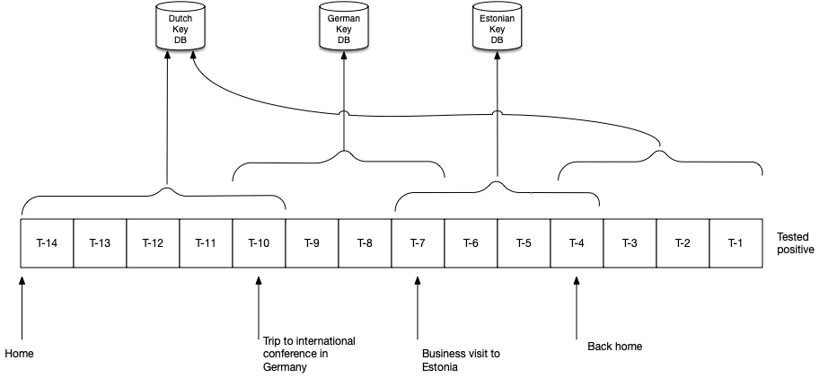
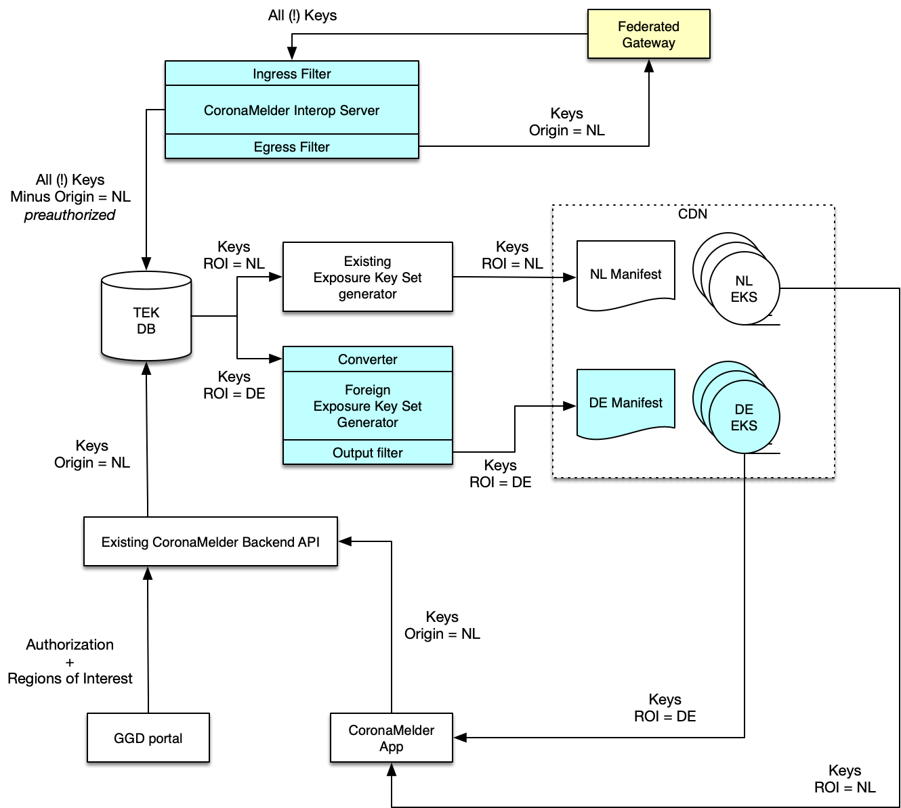

# International Interoperability

**Version**: 0.2, 28 august 2020

**Status**: Draft

**Authors**: 

* Ivo Jansch
* Maarten Brugman
* Dirk-Willem van Gulik
* Ryan Barrett

# Introduction

This document describes the architecture for interoperability between the Dutch CoronaMelder app and the apps of other countries in Europe via the European Union’s Federation Gateway Server (EFGS).

Interoperability means: users from one of the participating COVID19 Exposure Notification apps can receive a warning that they have been in close proximity of an infected user, regardless of which participating country or which app the infected user has used.

The basis for this interoperability are the following two EU e-Health network’s documents:

1. "eHealth Network Guidelines to the EU Member States and the European Commission on Interoperability specifications for cross-border transmission chains between approved apps: **Basic** interoperability elements between COVID+ Keys driven solutions" [EFGS/1]

2. "eHealth Network Guidelines to the EU Member States and the European Commission on Interoperability specifications for cross-border transmission chains between approved apps: **Detailed** interoperability elements between COVID+ Keys driven solutions" [EFGS/2]

The premise for interoperability lies in two key aspects:

* Countries that we want to interoperate with use the Google Apple Exposure Notification (GAEN) protocol (NOTE:  Other protocols may be considered later, but are currently out of scope for the initial interop version).

* Countries that we want to interoperate with are connected to the European Union Federation Gateway service (EFGS).

For now, we consider countries that do not use the EFGS out of scope for interoperability.

This document outlines all the technical and non functional details regarding the interoperability. 

# Contents

- [Background](#background)
  * [Travel challenges for exposure notifications](#travel-challenges-for-exposure-notifications)
- [Data Model](#data-model)
  * [Definitions](#definitions)
  * [Required key data for the app user](#required-key-data-for-the-app-user)
  * [Example scenario](#example-scenario)
  * [Determining regions of interest](#determining-regions-of-interest)
  * [Coordinating transmission risk levels between countries](#coordinating-transmission-risk-levels-between-countries)
  * [Avoiding duplicate notifications](#avoiding-duplicate-notifications)
- [High Level Architecture](#high-level-architecture)
  * [Overview](#overview)
    + [Filtering](#filtering)
  * [Impact Analysis](#impact-analysis)
    + [CoronaMelder Existing Back-end](#coronamelder-existing-back-end)
    + [CoronaMelder Interop Server](#coronamelder-interop-server)
    + [Exposure Key Set generator](#exposure-key-set-generator)
    + [GGD Portal](#ggd-portal)
    + [CoronaMelder App](#coronamelder-app)
- [API Design](#api-design)
  * [Interface between Dutch back-end and Federation Gateway](#interface-between-dutch-back-end-and-federation-gateway)
  * [Interface between Dutch back-end and the Dutch app](#interface-between-dutch-back-end-and-the-dutch-app)
    + [Manifest](#manifest)
    + [Exposure Key Set](#exposure-key-set)
- [Security Considerations](#security-considerations)
  * [GAEN Signatures](#gaen-signatures)
  * [CMS Signatures](#cms-signatures)
  * [Trust between Dutch back-end and Federation Gateway](#trust-between-dutch-back-end-and-federation-gateway)
  * [Key Stuffing](#key-stuffing)
- [Privacy Considerations](#privacy-considerations)
  * [Key sharing](#key-sharing)
  * [Key downloads](#key-downloads)
  * [Travel Destinations](#travel-destinations)
- [References](#references)

# Background

## Travel challenges for exposure notifications

Interoperability is not limited to travelers between countries. Residents of a country who do not travel might, unknowingly, still encounter an infected person from another country, who is visiting during a holiday or for work. 

Therefore, we need to look at the risks and features we need for both travelers and non-travelers. The following table describes the various options we have to deal with:

<table>
  <tr>
    <th>Who is at risk</th>
    <th>Potential source of infection</th>
    <th>What does the person at risk need for successful Exposure Notification?</th>
    <th>Remark</th>
  </tr>
  <tr>
    <td rowspan="3">Traveler</td>
    <td>Residents of country of origin (before departure)</td>
    <td>All keys of infected people in origin country</td>
    <td>This scenario is equal to domestic contact tracing, it doesn’t matter if the person is a traveler or not.</td>
  </tr>
  <tr>
    <td>Residents of destination country, when traveler was there </td>
    <td>All keys of infected people in destination country</td>
    <td></td>
  </tr>
  <tr>
    <td>Residents of third party countries that also visited the destination country at the same time as the traveler.</td>
    <td>All keys of infected people who have traveled to destination country, regardless of their origin</td>
    <td>Risk is higher for international events and tourist areas where people from many origins gather.</td>
  </tr>
  <tr>
    <td rowspan="2">Non-traveler</td>
    <td>Residents of country of origin </td>
    <td>All keys of infected people in origin country</td>
    <td>Equal to domestic contact tracing.</td>
  </tr>
  <tr>
    <td>Residents of third party countries that visited country of origin</td>
    <td>All keys of infected people of all countries who have visited origin country</td>
    <td>Risk is higher for international events and tourist areas where people from many origins gather.</td>
  </tr>
</table>

# Data Model

## Definitions

The following definitions are used in this document:

<table>
  <tr>
    <td>Origin</td>
    <td>The country which made the mobile application that the user is using; this includes the back-end the mobile application interacts with. More specifically - the crucial element is the GAEN public key that the GAEN framework on the phone uses to verify the digital signature on any TEK distributions. This is managed and set by Apple and Google as part of the mobile app approval process. </td>
  </tr>
  <tr>
    <td>Traveler</td>
    <td>A user who has a mobile app of a country (A) that is currently traveling in another country (B). I.e. who is traveling in an environment where most phones are originating from that country B; and will get their distributions from that origin B.</td>
  </tr>
  <tr>
    <td>Non traveler</td>
    <td>Person who is in the same country (Origin) as the country whose mobile app he or she is using.</td>
  </tr>
  <tr>
    <td>(Origin) Backend</td>
    <td>The backend that a mobile application interacts with. Is operated by and tied to the same country as to which the mobile app is tied by the digital signature managed by apple/google.</td>
  </tr>
  <tr>
    <td>Federation Gateway</td>
    <td>LUX based exchange service - that communicates securely (and only) with the participating Origin Backends.</td>
  </tr>
</table>

## Required key data for the app user

Deriving the ideal datasets that users of contact tracing apps need, from the above risk profiles,  we come to the following aggregate:

<table>
<tr>
 <td rowspan="4">Traveler’s app requires: 	</td>
 <td>a. All domestic keys of origin</td>  
</tr>
<tr><td>b. Keys of all travelers who traveled to origin </td></tr>
<tr><td>c. All domestic keys of destination </td></tr>
<tr><td>d. Keys of all travelers who traveled to destination</td></tr>
</td>
</tr>
<tr>
<td rowspan="2">Non-traveler’s app requires:</td>
<td>a. All domestic keys of origin</td></tr>
<tr><td>b. Keys of all travelers who traveled to origin</td></tr>
</table>

This maps nicely on the proposal for the Federation Gateway from the e-health initiative. This gateway stores keys for all participating countries and adds 2 important fields:

* The country of origin: which country (app) did the key come from.
* The *regions of interest*: for which regions is the key relevant.

If a traveler from The Netherlands travels to Germany, then the *origin* is ‘NL’ and the *region of interest* is 'DE', so that when the Dutch person is tested positive for COVID-19, their key can be shared with Germany to notify people they have met during their stay.

Mapping the country of interest on the above datasets, we get (for the example of a Dutch traveler to Germany) 4 keysets, marked **a** through **d** below:

<table>
<tr>
<td rowspan="4">Traveler’s app requires:</td>
<td>a. All domestic keys of origin</td><td>keys with origin = NL</td></tr>
<tr><td>b. Keys of all travelers who traveled to origin</td><td>keys with region of interest = NL</td></tr>
<tr><td>c. All domestic keys of destination</td><td>keys with origin = DE</td></tr>
<tr><td>d. Keys of all travelers who traveled to destination</td><td>keys with region of interest = DE</td></tr>	
<tr>
<td rowspan="2">Non-traveler’s app requires:</td>
<td>a. All domestic keys of origin</td><td>keys with origin = NL</td></tr>
<tr><td>b. Keys of all travelers who traveled to origin</td><td>keys with region of interest = NL</td></tr>
</table>

## Example scenario

To deal with two travellers meeting the process is as follows (for example for a Dutch Traveler and a German national that both met an Italian while all three where in Germany):

1. The Italian traveler is tested by the local health authorities in Italy and found infected. 
2. With her/his consent - her/his TEK(s) are added to the Italian backend; with the Country of Interest ‘DE’ (as the Italian has been in Germany).
3. The Italian back-end sends its data to the Federation Gateway.
4. The German back-end picks up this data and mixes this in with its domestic set **(b)**.
5. A German citizen’s mobile app picks up the German set **(a,b)** -- this yields a match from set **b**.
6. The Dutch citizen’s mobile app picks up the Dutch set **(a,b)**. This yields no matches. The Dutch citizen indicates that he has traveled to Germany and therefore also picks up set **c** and **d**; this yields a match on set **d**.

## Determining countries of interest

A key aspect in the above approach is that we need to know the ‘countries of interest’ of all the keys that a user has collected in the 14 days before their positive test.

The following diagram shows an example of a traveler who travels to Germany, then to Estonia and finally back home. 

*Figure 1: schematic of what countries a key is relevant for (T = day of test result)*

As we can see here, some keys only are relevant for the Dutch app ecosystem and have countries of interest = NL. But on T-10, T-7 and T-4, the keys have 2 countries of interest, because the key (which has a lifetime of a day typically) has RPIs that were broadcast in 2 countries on those days. The below table shows how the keys get ‘tagged’ after determining the countries of interest:

<table>
  <tr>
    <th>Key</th>
    <th>Day</th>
    <th>Origin</th>
    <th>Countries of interest</th>
  </tr>
  <tr>
    <td>1</td>
    <td>T-14</td>
    <td>NL</td>
    <td>NL</td>
  </tr>
  <tr>
    <td>2</td>
    <td>T-13</td>
    <td>NL</td>
    <td>NL</td>
  </tr>
  <tr>
    <td>3</td>
    <td>T-12</td>
    <td>NL</td>
    <td>NL</td>
  </tr>
  <tr>
    <td>4</td>
    <td>T-11</td>
    <td>NL</td>
    <td>NL</td>
  </tr>
  <tr>
    <td>5</td>
    <td>T-10</td>
    <td>NL</td>
    <td>NL, DE</td>
  </tr>
  <tr>
    <td>6</td>
    <td>T-9</td>
    <td>NL</td>
    <td>DE</td>
  </tr>
  <tr>
    <td>7</td>
    <td>T-8</td>
    <td>NL</td>
    <td>DE</td>
  </tr>
  <tr>
    <td>8</td>
    <td>T-7</td>
    <td>NL</td>
    <td>DE, EE</td>
  </tr>
  <tr>
    <td>9</td>
    <td>T-6</td>
    <td>NL</td>
    <td>EE</td>
  </tr>
  <tr>
    <td>10</td>
    <td>T-5</td>
    <td>NL</td>
    <td>EE</td>
  </tr>
  <tr>
    <td>11</td>
    <td>T-4</td>
    <td>NL</td>
    <td>EE, NL</td>
  </tr>
  <tr>
    <td>12</td>
    <td>T-3</td>
    <td>NL</td>
    <td>NL</td>
  </tr>
  <tr>
    <td>13</td>
    <td>T-2</td>
    <td>NL</td>
    <td>NL</td>
  </tr>
  <tr>
    <td>14</td>
    <td>T-1</td>
    <td>NL</td>
    <td>NL</td>
  </tr>
</table>

Side note: in the Dutch CoronaMelder back-end it’s unlikely that we would actually share 14 keys. After applying the ‘days of symptom onset’ a number of keys that are deemed outside the infectious period of the user, will not be shared. But let us assume for now that all 14 keys of this user are infectious and shared. This design also includes the possibility to apply such filtering to the data received from other countries prior to its distribution to dutch citizens and/or adjust these risk settings (the principle here is that each country’s National Health Authority determines these tradeoffs).

All keys are sent to the Federation Gateway. Keys 1 to 5 and 11 to 14 are published on the Dutch CDN. The RPIs of keys 6 to 10 have not been broadcast in NL, so while they are sent to the Gateway, they are not part of the Dutch keysets.  

## Coordinating transmission risk levels between countries

The Dutch CoronaMelder app uses the recommended values for Transmission Risk Level as specified by Apple (NOTE:  See https://developer.apple.com/documentation/exposurenotification/enexposureconfiguration/3586323-transmissionrisklevelvalues):

0 = Unused/Custom

**1 = Confirmed test: Low transmission risk level**

**2 = Confirmed test: Standard transmission risk level**

**3 = Confirmed test: High transmission risk level**

4 = Confirmed clinical diagnosis

5 = Self report

**6 = Negative case**

7 = Recursive case

Only the bold ones are used in NL. The Negative Case (6) is used only temporarily, when due to days of symptom onset filtering, we want to remove certain keys. These keys get assigned value 6, and will not be exported to the CDN or the EFGS.

If countries use the same definition, interoperability is immediately achieved. If countries use a custom mapping, then our back-end will have to do a conversion between the originating country’s risk levels and our own (or remove them altogether; for example in the case of ‘self diagnosis’, which the Dutch app does not support).

## Avoiding duplicate notifications

Because we are performing a 2-way exchange of keys between the gateway and our back-end, we must pay attention to not create duplicate notifications (for example because keys we have contributed to the gateway are re-downloaded when we download from the gateway). This can also be a problem if a key has 2 countries of interest and ends up both in the domestic and the foreign set. We want to avoid duplicate notifications, so the Dutch server should publish each key only once for its users.

# High Level Architecture

## Overview

The following diagram depicts a high level architecture of our interaction with the Federation Gateway. Here we can see the relationship between the *origin* of the key and the *countries of interest* of the keys, and where keys come from and how they are published.

We publish the foreign keysets on the CDN in a separate folder so that these files can be selectively downloaded by only those residents who have traveled *to* a particular country. Residents who do not travel only need the NL keysets, which include all keys that have ‘countries of interest’ NL (whether they originated from NL or from other countries).

The blue parts are new compared to the existing setup. The yellow parts are external.

*Figure 2: Interactions between components*

Note how keys that are uploaded by our app are authorized by the GGD (see Solution Architecture, lab confirmation flow). Keys that are downloaded from the Federation Gateway are *pre-authorized*. We assume that those keys were validated by the health authority in their country of origin.

### Filtering

To ensure adequate day to day operational control and some level of digital sovereignty for the National Health Authorities several filters are introduced in the diagram in the previous chapter. These filters are a compromise with the principle of not irrevocably deleting or modifying data from other countries on the one hand and the desire to keep as little information as possible on the other hand.

The **Ingress** filter is applied prior to any storage and is to filter out any data that does not meet National policy; for example around privacy. This data is simply stopped at the edge and never reaches the database. Criteria of filtering are Country of Interest (CoI), Period, Length and Risk level.

Note that other countries may well use other Risk Level definitions. The Ingress filter needs to store the original value that is retrieved from the EFGS as a separate value, distinct from the Risk Levels we use.

The EFGS interface for fetching TEKs takes a date and a batchTag for keeping track of what our server has downloaded so far. No filtering options are available in this interface. Filtering on the Ingress filter does not interfere with fetching the data.

The **Converter **filter is applied just prior to the data being packaged. It converts things such as risk levels. The reason for having this applied post storage is to allow operational changes and retransmission. This also lets the National Health authority delay or speed up certain data - as to adjust capacity and demand.

The **Output** filter can filter out certain countries operationally; for example to manage capacity. Initially this filter will not filter anything. The need for filtering will be discussed with the Dutch Health Authority.

The **Egress** filter is applied prior to sending data to the Federation Gateway. For example if the National health authority considers a certain country not yet fit to be informed of the CoI of dutch travellers.

## Impact Analysis

Currently the number of positive test numbers in Europe is low. This allows us to implement international interoperability in two distinct phases: initially publishing all keys to all users and later on publishing keys from other origins seperately so that they can be downloaded on-demand.

Here follows a high level overview of the implementation.

### Phase One

In the first phase we will implment the upload and download of keys to the Federation Gateway. These keys will be distributed inline with our own keys. There will be no changes made to the apps.

The focus in this phase is on getting the communication pipeline up and running in a stable manner whilst minimizing changes to existing code.

- The following changes will be made to the backend:
  * The database will be expanded with **origin** and **countries of interest** fields to the TEK.
  * The backend services will be expanded to accept the countries of interest per day from the GGD authorization flow[1](#ggd-auth-flow-footnote).
  * The EksEngine will be modified to support the new stuffing requirements described under [Key Stuffing](#Key-Stuffing).
  * GGD Portal will be modified to allow the GGDs to specify countries of interest per day.

- Interop server will be implemented, supporting:
  * Upload of our keys (i.e. origin of NL) to the Federation platform.
  * Filtering of keys before upload (**egress** filter)
  * Download of keys from the Federation platform on a regular but configurable schedule.
  * Filtering of keys downloaded (**ingress** filter).
  * Insertion of keys from origins other than NL into our Exposure Key Sets.

- No changes will be made to either app.

The implementation will be described in detail in the folder /docs/technical-designs/interop.md in the backend repository.

<a name="ggd-auth-flow-footnote">1</a>: Note a caveat: GGD authorization and Keys arrive in the back end asynchronously via 2 different channels - this should be taken into account when applying the ROI to keys - the ROI might arrive before the actual keys arrive.

### Phase two

In the second phase we will add support for on-demand downloading of keys from origins other than NL.

The focus of phase two will be on publishing keys from each origin to their own dedicated streams and updating the apps so that users can download keys from other origins on-demand.

- The following changes will be made to the backend:
  * EksEngine will be updated to generate multiple Exposure Key Sets (EKS), one per origin, such that each EKS contains keys from a single origin.
  * A new InteropManifestEngine will be built. This engine is similar to ManifestEngine, only it will implement the new InteropManifest specified under [API Design](#API-Design). It will generate one manifest per origin for all origins except NL.
  * ManifestEngine will be updated so that it only operates on keys with the origin of NL.
  * ContentApi will be expanded to support the new APIs specified under [API Design](#API-Design).

The backend implementation will be described in detail in the folder /docs/technical-designs/interop.md in the backend repository.

- The following changes will be made to both the iOS and Android apps:
  * A new UI will be added to allow the user to decide which countries to scan.
  * The new APIs specified under [API Design](#API-Design) will be supported.

[TODO: where will be screens be designed and technical design added for the he frontend implementation?].

# API Design

## Interface between Dutch back-end and Federation Gateway

For the interface between the Dutch backend and the Federation Gateway we follow the specifications of the Federation Gateway [EFGS/2]. The Gateway offers both push and pull models. Our choices here are:

1. Keys that the Dutch backend should share **to** the Gateway will be periodically **pushed** to the Gateway. 

2. Keys that the Dutch backend needs **from** the Gateway will be periodically **pulled** from the Gateway.

This model ensures that the Dutch back-end only needs outgoing connections, and does not need to offer any additional open endpoints. This greatly simplifies the security design.

## Interface between Dutch back-end and the Dutch app

The interface between the Dutch CoronaMelder backend and the apps is enhanced with 2 urls, which are more or less the same as the current calls, but separated per ‘countries of interest’

### Manifest

[https://coronamelder-dist.nl/[country]/manifest](https://coronamelder-dist.nl/[country]/manifest)

The manifest file in the current back-end contains all Dutch key files. To not hugely increase this manifest’s size, we create new separate manifests per countries of interest. The international manifests will look like this:

{ 
    keySets: [
        { 
            "id": “b2eaf132be1ef”,
            “dateFrom”: “2020-08-01”,
            “dateTo”: “2020-08-15”
        },
        {
            “id”: “24bcd345”,
            ….
        }

    ]

}

The reason each keyset has a dateFrom and dateTo is that this way we can see that it contains keys for a certain date range. Clients could selectively download only files that contain keys for the days that the user was abroad. This would however require that the user not only indicates that he visited another country, but also exact dates.

Note that this manifest contains less fields than the domestic manifest, as there are no risk parameters or app config as we have in the domestic manifest

We need to balance the granularity of the keyfiles with the overhead in each file and the transmission overhead. This will be refined in a future version.

### Exposure Key Set

https://coronamelder-dist.nl/[country]/exposurekeyset/[id]

An Exposure Key Set follows the exact same structure as our existing Exposure Key Sets, but with a country identifier in the URL. The URL includes the filename of the set. (The filename will be determined by the backend, similar to how it's currently producing those filenames for domestic key sets.)

# Security Considerations

## GAEN Signatures

The CoronaMelder app has a registered public key with apple and google, that is used to validate keysets. Since our app can only access our national (Dutch) public keys, we can’t re-use foreign GAEN signatures. When generating keysets, the CoronaMelder back-end should sign the packages with the **Dutch** unmanaged GAEN key.

## CMS Signatures

The same holds true for the PKI Overheid CMS signatures that we place on files. We can’t reuse foreign certificates, so the files that we publish on the CDN should be signed with the Dutch PKI Overheids certificates, exactly the same as we do with the domestic keysets.

## Trust between Dutch back-end and Federation Gateway

When exchanging keys, the Federation Gateway and the Dutch backend mutually authenticate with a X.509 client and server certificates, as described in [EFGS/2] (Section 6). The Dutch back-end will verify (pin) the Federation Gateway explicitly. The Federation Gateway will authenticate the Dutch back-end explicitly (page 48 of [EFGS/2])

## Key Stuffing

In theory it could happen that we send only a few files from a few infected persons to the gateway. To ensure that a compromised gateway wouldn’t be able to link keys so it can track persons across multiple days, the same stuffing rules as applied domestically are applied before we upload them to the Gateway. In addition to the stuffing we currently do, we should also randomize countries of interest, so real keys are indistinguishable from stuffed keys.

# Privacy Considerations

It is recommended to update the DPIA (Data Protection Impact Analysis) of the CoronaMelder app to take interoperability considerations into account. The chosen architecture by the European eHealth initiative and our connection with it introduce a number of elements that warrant DPIA analysis. 

## Key sharing

Since diagnosis keys rotate on a daily basis and a user may have visited multiple countries on the same day, the chosen data sharing solution means that one temporary daily key can be sent to multiple countries, via the gateway. This means that:

1. The country that receives keys from travelers, can see how many infected people have traveled to that country, and (depending on the implementation), from where.

2. The Federation Gateway has origin and countries of interest of all keys from all participating countries, so has knowledge about travel patterns between countries. 

In both cases only the total number is known; the individual residents can’t be derived from just these databases.

The information is limited to a specific day because daily keys are unlinkable. With unlinkable keys, it isn’t possible to create a ‘trail’ that spans more than a single day.

## Key downloads

Theoretically our CDN can ‘see’ which countries of interest an app is downloading, so it might ‘leak’ that a user has traveled. To mitigate this, all countries could be placed in the same files, but that would lead to a lot of extra data for users that may not even have traveled. It is better to rely on not logging requests on the cdn in a way that they can be related to an IP address. At this time the KPN CDN does not log IP addresses nor requests (as defined in the SLA).

It is important that the user by choice/consent downloads keys for other countries of interest.

The chosen model ensures that only our own CDN is hit by the user’s app. The foreign keys are never sourced directly from other countries but only via the Federation Gateway and our own interop server. 

## Travel Destinations

The app does not and will not use location information. This means that the user needs to indicate they have been traveling. This happens in two places. 

1. If an app user has traveled and wants to receive notifications in case they have met an infected person abroad, they should tell the app that they have traveled to a certain country and want to download that country’s key information for the next 14 days. This info does not need to be shared with the Corona app back-end. The CDN could ‘see’ that the user downloads a particular country, so it’s important to uphold the CDN’s promise of not logging such requests in combination with an IP address. Nevertheless the user should be aware that he is asking for content from a particular country. 

2. An infected user already tells the GGD that they have traveled as part of the Bron and Contact Onderzoek (BCO) conversation. The GGD will enter this information into the coronamelder portal, associated only to the 6 digit code that was entered. The coronamelder backend is therefore unable to link back the destination information to a particular user. 

# References

[EFGS/1] 	eHealth Network Guidelines to the EU Member States and the European Commission on Interoperability specifications for cross-border transmission chains between approved apps; Basic interoperability elements between COVID+ Keys driven solutions; V1.0 2020-06-16 
[https://ec.europa.eu/health/sites/health/files/ehealth/docs/mobileapps_interoperabilityspecs_en.pdf](https://ec.europa.eu/health/sites/health/files/ehealth/docs/mobileapps_interoperabilityspecs_en.pdf)

[EFGS/2] 	eHealth Network Guidelines to the EU Member States and the European Commission on Interoperability specifications for cross-border transmission chains between approved apps; Detailed interoperability elements between COVID+ Keys driven solutions; V1.0 2020-06-16 [https://ec.europa.eu/health/sites/health/files/ehealth/docs/mobileapps_interoperabilitydetailedelements_en.pdf](https://ec.europa.eu/health/sites/health/files/ehealth/docs/mobileapps_interoperabilitydetailedelements_en.pdf)

