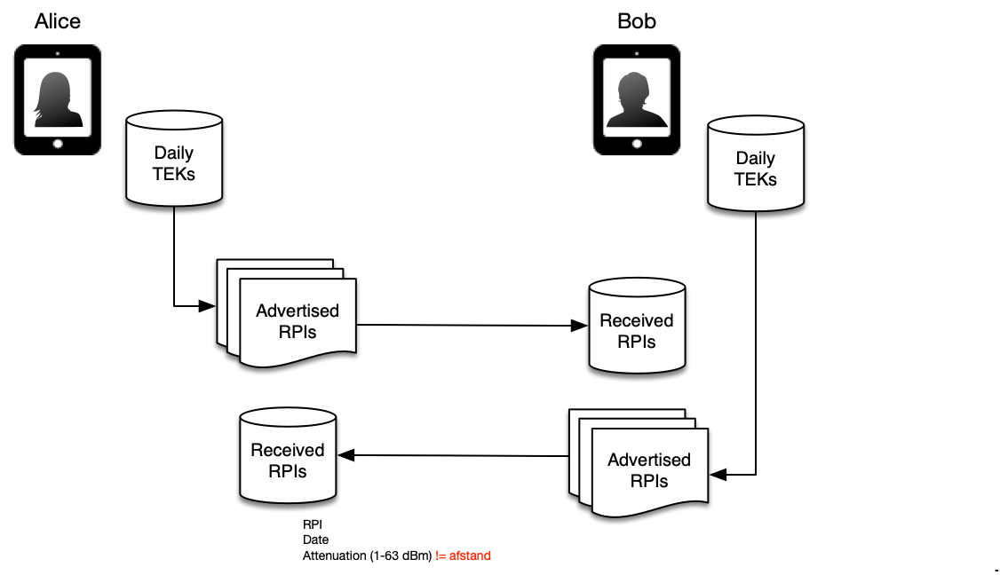

Traffic analysis mitigation with decoy traffic
==============================================

# Introduction

The COVID-19 notification app allows a user who has been tested positive to upload TEKs (Temporary Exchange Keys) to the app’s back end servers. Anybody who can monitor the network traffic of the user’s device (smartphone) could potentially derive from the upload traffic that the user has a COVID-19 infection. This is a major privacy concern. This document describes how to mitigate network traffic analysis by systematically sending ‘decoy’ traffic that is indistinguishable from real TEK uploads.

Persons or entities that can listen in on network traffic include:

* If user is on a public Wi-Fi hotspot, anybody on the same public Wi-Fi hotspot can monitor network traffic.

* If user uses a corporate VPN, the corporate employer can continuously monitor the VPN network traffic to detect possible infections among employees.

* If user is on a home or corporate Wi-Fi network, anybody on the same Wi-Fi network can monitor the network traffic, such as housemates, colleagues, etc.


# TEK upload sequence

Genuine TEK uploads are a sequence of 2 calls from app to server:

1. /register, to request a one-time password (labConfirmationID) and an accompanying confirmationKey and bucketId. This call is made whenever the user opens the Upload screen.

2. /postkeys, to submit the TEK keys. This call is made when the user presses the Upload button on the Upload screen.

In between the two calls, the user reads the labConfirmationID to the health care worker over the phone. This will take some time, typically from 5 to 60 seconds (this is an estimation; not a result from a user test).

The following table plots this observable network traffic on a timeline. For this example, a delay of 20 seconds is used between the first and second call.

<table>
  <tr>
    <th>Timestamp
example (sec:ms)</th>
    <th>Duration
example (sec:ms)</th>
    <th>Duration label</th>
    <th>Action</th>
    <th>Network
packet length</th>
    <th>Actor</th>
  </tr>
  <tr>
    <td>0:000</td>
    <td>0:100</td>
    <td>Treg_req</td>
    <td>Send /register request</td>
    <td>Lreg_req</td>
    <td>App</td>
  </tr>
  <tr>
    <td>0:100</td>
    <td>0:300</td>
    <td>Treg_prc</td>
    <td>Process /register request</td>
    <td>-</td>
    <td>Server</td>
  </tr>
  <tr>
    <td>0:400</td>
    <td>0:100</td>
    <td>Treg_rsp</td>
    <td>Send/register response</td>
    <td>Lreg_rsp</td>
    <td>Server</td>
  </tr>
  <tr>
    <td>0:500</td>
    <td>20:000</td>
    <td>Tuser</td>
    <td>Read lab conf code to operator; duration 20s in this example</td>
    <td>-</td>
    <td>User</td>
  </tr>
  <tr>
    <td>20:500</td>
    <td>0:100</td>
    <td>Tkey_req</td>
    <td>Send /postkeys request</td>
    <td>Lkey_req</td>
    <td>App</td>
  </tr>
  <tr>
    <td>20:600</td>
    <td>0:500</td>
    <td>Tkey_prc</td>
    <td>Process /postkeys request</td>
    <td>-</td>
    <td>Server</td>
  </tr>
  <tr>
    <td>21:100</td>
    <td>0:150</td>
    <td>Tkey_rsp</td>
    <td>Send /postkeys response</td>
    <td>Lpst_rsp</td>
    <td>Server</td>
  </tr>
  </table>

Additional scenarios to take into account are:

* The user may change their mind about uploading their keys after the /register call has been made. Then the /postkeys call will not be invoked.

* The user may open the Upload screen and press the Upload button at any time, without having been tested and without being called by the health authority. So a TEK upload sequence does not imply that the user has been tested positive.

* The first call (to /register) might fail due to communications failure or server failure, resulting in one or even more retries.

* The second call (to /postkeys) might fail due to communications failure or server failure, resulting in one or even more retries.


# Making individual requests indistinguishable

An observer can detect and analyse all the Txxx_xxx request and response times, and all the Lxxx_xxx message lengths in the above table.

To mitigate this, the following measures are taken for /register calls, for /postkeys calls, and for decoy calls:
* request size randomization with same bandwidht for all request messages
* response size randomization with same bandwidth for all response messages
* response time randomization for all message handling

These measures are described in the following subsections.

As a consequence of these measures, an observer cannot distinguish between /register calls and /postkeys calls, nor between individual real and decoy calls.

## request size randomization
All calls to /register and /postkeys will have random request sizes within a certain bandwidth, by using padding.

This requires that both apps (Android and iOS) add padding to the /register and /postkeys request payloads, and to the /stopkeys decoy traffic endpoint introduced later on. 
The request messages contain a `padding` field that must contain random characters. (Characters must be random, so that any zip compression in the chain does not reduce the message size and reveal decoy traffic.)
Further, the app's `Appconfig` contains two parameters `requestMinimumSize` and `requestMaximumSize` that specify
the minimum and maximum size in bytes of the total request payload. The app generates a random integer `messageSize = random(requestMinimumSize..requestMaximumSize)` from a negative exponential distribution and adds random padding characters to the `padding` field to get the request payload to be size `messageSize`. If the payload size is already larger than `messageSize`, the `padding` field is set to `""`.

We set the default `requestMinimumSize` at __1800 bytes__, and the default `requestMaximumSize` at __110,000 bytes__. See Appendix 1 for a calculation of these sizes.

### number of TEKs in upload and excess message size

A user may repeatedly open the Upload screen and press the Upload button. 
Whenever the Upload button is pressed, the last 14 day's TEKs are retrieved from the Exposure Notification framework (EN framework). The EN Framework at this time generates a new TEK for the current day, for privacy reasons. This means that the number of TEKs on a day is equal to one plus the number of times the user presses the Upload button on that day. In theory, there is no upper bound on this. Users may open the Upload Screen and press the Upload button as often as they wish. Further, other events might trigger a TEK rotation, e.g. another installed EN app or a button in the EN settings. So a TEK upload message may contain a large number of TEKs.

Hence an observer of the network traffic knows that a request message with a size larger than `maximumRequestSize` is not a decoy request message.
However, the observer cannot be sure that the upload message is a real upload that is confirmed by the health authority, since the user may also perform the upload without being called by the health authority. So a request message larger than `maximumRequestSize` does not reveal a health authority-confirmed TEK upload.

## response size randomization
The back end server has two system parameters `responseMinimumSize` and `responseMaximumSize`. For the /register and /postkey response messages, it generates a a random integer `messageSize = random(responseMinimumSize..responseMaximumSize)` and adds random padding characters to the `padding` field to get the response payload to be size `messageSize`.

The default `responseMinimumSize` is set to __200 bytes__ and the default 
`responseMaximumSize` is set to __400 bytes__. See Appendix 2 for a calculation of these sizes.

## response time randomization
All calls to /register and /postkeys need to have comparable response times within a certain bandwidth. This needs to be handled at the server side. The decoy traffic introduced later on may be handled by different server-side components, but the response times of the decoy traffic need to be similar to the response times of the real /register and /postkeys handlers. This may be achieved by randomization of the decoy traffic response times.


# TEK upload observation

Without any decoy traffic, an observer can deduce the following:

* 0 calls on a day: no upload

* 1 call on a day: no upload

* 2 calls on a day with interval < 5 minutes: likely upload (/register and /postkeys have been invoked, maybe during a call with health authority, or /register has been retried, which is unlikely)

* 2 calls on a day with interval > 5 minutes: maybe an upload (/register and /postkeys have been invoked) or user opened Upload screen twice, resulting in 2 /register calls.

## Combination of TEK upload and phone call

Another datum that may be observed is that during a genuine TEK upload (/register and /postkeys calls) the device is having a phone call with the health authority worker. If this is a VoIP call, this will be visible on the WiFi network. If this is a cell phone call, its call metadata could be analysed by e.g. corporate device management software, or by a nearby observer.

Decoy traffic as described below will make this analysis less valuable.

# Decoy traffic design

The apps will schedule simulated TEK uploads on random days.

## Random simulated TEK upload

In terms of decoy traffic volume, we will generate about 20 times the expected genuine TEK upload traffic. This is a number that we expect will hide the genuine traffic well, and at the same time does not burden the back end servers too much.

Let us calculate how much this 20x decoy traffic will be on average.

The daily infection numbers of the pandemic over the course of March to June 2020 is shown in the following graph (retrieved 22 Jun 2020 from [https://www.rivm.nl/coronavirus-covid-19/grafieken](https://www.rivm.nl/coronavirus-covid-19/grafieken)).



So for the calculation of the required decoy traffic volume let us take a number of daily infections of 1000. 

And let us assume (optimistically) that half of the Dutch population use the app and are willing to perform the key upload. 
That would mean 500 genuine uploads per day. And that would mean 20x 500 = 10000 decoy uploads per day.

Half of the Dutch population in 2020 means about 8.5M users.
This means that each app installation needs to generate 10000 / 8.5M = 0.00118 average decoy TEK upload sequences per day.

Note that the total amount of decoy traffic is proportional to the number of app users and with the key uploads that those app users perform. So a lower number of app users will maintain the 20:1 rate of decoy traffic versus genuine traffic.

The decoy traffic is then generated by the app as follows:

1. Every day at 1:00 AM, determine whether a decoy traffic sequence is to be scheduled with a probability of `Appconfig.decoyProbability` (taken from the `/appconfig` response). This is a value between 0 and 1. The default value when the app has not successfully retrieved `Appconfig` yet, is the aforementioned 0.00118.
So take a number `R = random(0..1)` and only if `R < Appconfig.decoyProbability`, continue with the next step.
Otherwise, stop this procedure and wait for the next round (in 24 hours).
1. Pick a random time `decoyTime` between 7AM and 7PM of the current day.
(Note: we do not take into account Sundays and holidays that may have no genuine upload traffic since health authority offices may be closed.)
1. Schedule a decoy transmission job (simulating a /register call) at `decoyTime`.
1. Pick a random number of seconds `decoyInterval = random (5..900)` (interval between first and second decoy call).
1. Schedule a second decoy transmission job (simulating a /postkeys call) for time `decoyTime + decoyInterval`.

Each decoy transmission job does the following:
1. Create a valid request message payload `KeysRequest` with 1 random TEK, a random bucketId and padding as described above, plus a random signature
1. Send this request to the /stopkeys decoy endpoint
1. Ignore the response


# Appendix 1: calculation of minimum and maximum /postkeys request sizes

## minimum upload request size: 1800 bytes
Below is a sample /postkeys request.
The JSON is pretty-printed for readability.
However, the clients send JSON messages without whitespace.

This sample request is 1704 bytes long when whitespace is stripped.
We round this off and set `minimumRequestSize` to __1800 bytes__.

```
{
    "keys": [
        {
            "keyData": "bHcL2Vxrgk0BOkShJiMQUA==",
            "rollingStartNumber": 2655936,
            "rollingPeriod": 144,
            "regionsOfInterest": [
                "NL"
            ]
        },
        {
            "keyData": "bHcL2Vxrgk0BOkShJiMQUA==",
            "rollingStartNumber": 2655936,
            "rollingPeriod": 144,
            "regionsOfInterest": [
                "NL"
            ]
        },
        {
            "keyData": "bHcL2Vxrgk0BOkShJiMQUA==",
            "rollingStartNumber": 2655936,
            "rollingPeriod": 144,
            "regionsOfInterest": [
                "NL"
            ]
        },
        {
            "keyData": "bHcL2Vxrgk0BOkShJiMQUA==",
            "rollingStartNumber": 2655936,
            "rollingPeriod": 144,
            "regionsOfInterest": [
                "NL"
            ]
        },
        {
            "keyData": "bHcL2Vxrgk0BOkShJiMQUA==",
            "rollingStartNumber": 2655936,
            "rollingPeriod": 144,
            "regionsOfInterest": [
                "NL"
            ]
        },
        {
            "keyData": "bHcL2Vxrgk0BOkShJiMQUA==",
            "rollingStartNumber": 2655936,
            "rollingPeriod": 144,
            "regionsOfInterest": [
                "NL"
            ]
        },
        {
            "keyData": "bHcL2Vxrgk0BOkShJiMQUA==",
            "rollingStartNumber": 2655936,
            "rollingPeriod": 144,
            "regionsOfInterest": [
                "NL"
            ]
        },
        {
            "keyData": "bHcL2Vxrgk0BOkShJiMQUA==",
            "rollingStartNumber": 2655936,
            "rollingPeriod": 144,
            "regionsOfInterest": [
                "NL"
            ]
        },
        {
            "keyData": "bHcL2Vxrgk0BOkShJiMQUA==",
            "rollingStartNumber": 2655936,
            "rollingPeriod": 144,
            "regionsOfInterest": [
                "NL"
            ]
        },
        {
            "keyData": "bHcL2Vxrgk0BOkShJiMQUA==",
            "rollingStartNumber": 2655936,
            "rollingPeriod": 144,
            "regionsOfInterest": [
                "NL"
            ]
        },
        {
            "keyData": "bHcL2Vxrgk0BOkShJiMQUA==",
            "rollingStartNumber": 2655936,
            "rollingPeriod": 144,
            "regionsOfInterest": [
                "NL"
            ]
        },
        {
            "keyData": "bHcL2Vxrgk0BOkShJiMQUA==",
            "rollingStartNumber": 2655936,
            "rollingPeriod": 144,
            "regionsOfInterest": [
                "NL"
            ]
        },
        {
            "keyData": "bHcL2Vxrgk0BOkShJiMQUA==",
            "rollingStartNumber": 2655936,
            "rollingPeriod": 144,
            "regionsOfInterest": [
                "NL"
            ]
        },
        {
            "keyData": "bHcL2Vxrgk0BOkShJiMQUA==",
            "rollingStartNumber": 2655936,
            "rollingPeriod": 144,
            "regionsOfInterest": [
                "NL"
            ]
        }
    ],
    "bucketId": "EtIaYg3yLKnvPmoYzaJpdyqpOTx5SPVlT2x1pI8u+bQ=",
    "padding": "ZGVmYXVsdA=="
}
```

## maximum request size: 110,000 bytes
One TEK with one regionOfInterest in JSON format, with comma separator at the end is: 

    {"keyData":"bHcL2Vxrgk0BOkShJiMQUA==","rollingStartNumber":2655936,"rollingPeriod":144,"regionsOfInterest":["NL"]},
 
This is 115 bytes long.

Let us assume that the users only rarely upload or rotate their TEKs more than 1000 times in 14 days.
So 1000 TEKs occupy 1000 x 115 = 115,000 JSON bytes in an upload message. The rest of the JSON payload is less than 100 bytes. We set a `maximumRequestSize` for decoy messages at __110,000 bytes__, allowing for close to 1000 TEKs in the upload message.

For each country the user travels to on a day, a 5 byte entry is added to the TEK's `regionsOfInterest` field, e.g. `,"DE"`. This increases the TEK size only marginally, and we do not increase the `maximumRequestSize` for this.


# Appendix 2: caclulation of minimum and maximum response sizes
A sample /register response is shown below.

    {"labConfirmationId":"TRQ-SVZ","bucketId":"cG90tM1ekKZ3rvhw7joPijxJZlXgtc7TYbiYzpkFdJo=","confirmationKey":"/032olvdoznvtsZLTYV5FEyrSpMpDn14+fvQ6yOgEds=","validity":46405,"padding":""}

This is 184 bytes without whitespace.

A sample /postkeys response is `{"padding":""}`

So to make these two responses indistinguisable in length, we set `responseMinimumSize` to __200 bytes__ and `responseMaximumSize` to __400 bytes__. Response length must be randomized between these values by the server by filling the `padding` field. The difference between the minimum and maximum should mitigate analysis on different response lengths between real and decoy traffic endpoints due to different lengths in HTTP response headers, cookies etc.
